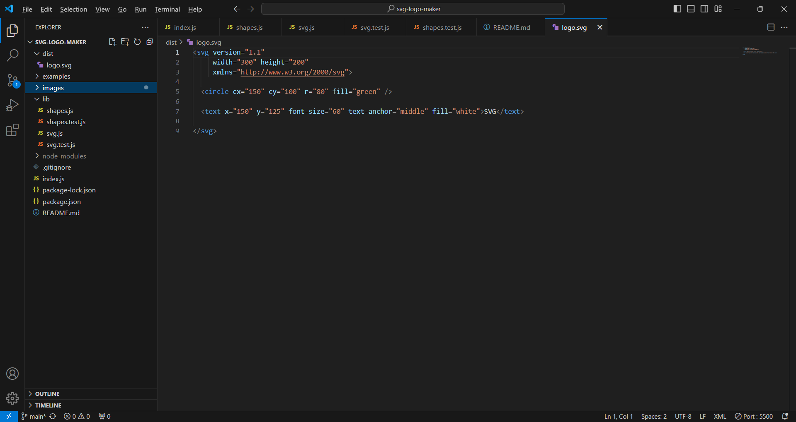
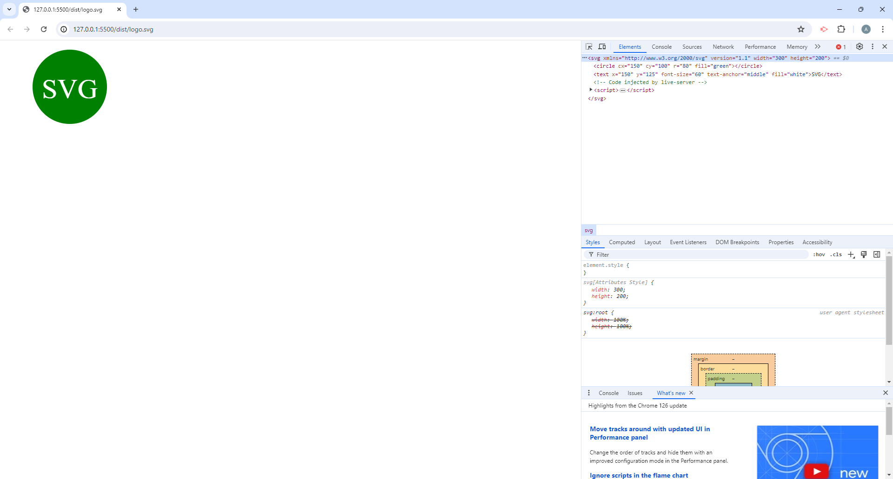

# svg-logo-maker

## Description

For goal of this project was to create a Node.js command-line application that would generate a logo as a SVG file using user submitted inputs.

## Installation

You will need to open the terminal and run npm install so that inquirer will load into the application.

## Usage

After installing inquirer you type node index.js into the terminal, and the terminal will ask a series of questions that will generate the SVG file.

Below are screenshots showing a generated SVG file and browser image.

Link to a walkthrough video showing the application in action:
[Walkthrough Video](https://drive.google.com/file/d/1pGNXJnnG7iDfFd8i7O6E-eS3oDSRJB6E/view)

## Credits

N/A

## License

N/A

## Contribute

N/A
